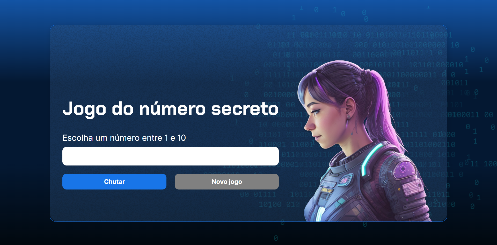

# 🎯 Jogo do Número Secreto


Um jogo interativo desenvolvido com **HTML, CSS e JavaScript**, onde o jogador deve adivinhar um número secreto gerado aleatoriamente.

💡 O grande diferencial deste projeto é a **integração com síntese de voz**, tornando a experiência mais dinâmica e acessível.

---

## 🖥️ Preview




---

## 🚀 Funcionalidades

✔️ Geração de número aleatório  
✔️ Sistema de dicas (maior 📈 ou menor 📉)  
✔️ Interface simples e intuitiva  
✔️ Narração automática por voz 🔊  
✔️ Feedback em tempo real  
✔️ Reinício do jogo  

---

## 🧠 Lógica do jogo

```text
1. O sistema gera um número secreto
2. O jogador digita um palpite
3. O jogo informa se o número é maior ou menor
4. O jogador continua tentando
5. Ao acertar, recebe uma mensagem de vitória 🎉
